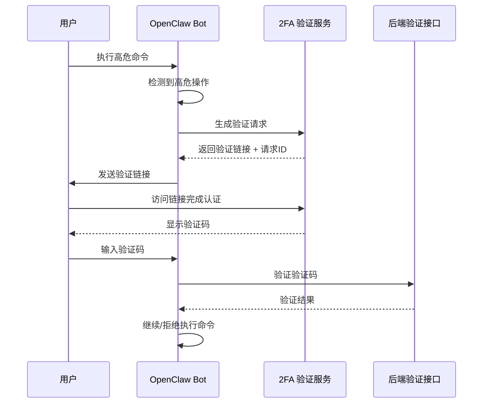

# OpenClaw 二次认证（2FA）高危操作保护实现方案

## 概述

本方案旨在为 OpenClaw 添加二次认证功能，当检测到高危操作时，暂停执行并要求用户通过外部链接进行二次认证。认证通过后获取验证码，输入验证码后 OpenClaw 验证通过方可继续执行命令。

## 调研结论

### 项目能力分析

经过详细调研，**OpenClaw 项目完全具备实现二次认证功能的基础架构**：

#### 1. 现有批准机制
- **`src/infra/exec-approvals.ts`**：完整的命令审批系统
  - 支持 `deny`、`allowlist`、`full` 三种安全模式
  - 支持 `always`、`on-miss`、`off` 三种 ask 模式
  - 具备 socket 通信机制进行审批
  - 支持 agent 级别的权限配置

- **`src/gateway/exec-approval-manager.ts`**：批准流程管理器
  - `create()`: 创建待审批记录
  - `waitForDecision()`: 异步等待审批决定（带超时）
  - `resolve()`: 解决审批请求

#### 2. 命令执行钩子
- **`src/agents/bash-tools.exec.ts`**：命令执行工具
  - 已有 `approval-pending`、`approval-id`、`approval-slug` 状态
  - 支持审批超时机制（默认 120 秒）
  - 支持审批请求超时机制（默认 130 秒）

#### 3. Webhook/Hooks 系统
- **`src/gateway/hooks.ts`**：外部调用接口
  - 支持 Bearer Token 认证
  - 支持 JSON body 解析
  - 可扩展为二次认证回调接口

#### 4. 多平台集成
- Discord、Telegram、Slack、Line、Signal 等多平台支持
- 统一的消息发送机制，便于发送认证链接

---

## 实现方案

### 架构设计



### 模块设计

#### 1. 高危操作检测器 [NEW]
**文件**: `src/security/high-risk-detector.ts`

功能：
- 定义高危操作规则（命令模式匹配）
- 检测命令是否属于高危操作
- 支持可配置的规则列表

```typescript
// 高危操作示例规则
const HIGH_RISK_PATTERNS = [
  /^rm\s+(-rf?|--recursive)\s+/,        // 删除命令
  /^(sudo|doas)\s+/,                     // 提权命令
  /\bdrop\s+(database|table)\b/i,        // 数据库删除
  /^git\s+push\s+(-f|--force)/,          // 强制推送
  /^kubectl\s+delete\s+/,                // K8s 删除
  /^docker\s+(rm|rmi|system\s+prune)/,   // Docker 清理
];
```

---

#### 2. 二次认证管理器 [NEW]
**文件**: `src/security/two-factor-auth.ts`

功能：
- 生成认证请求和验证码
- 管理待认证状态
- 验证用户提供的验证码

```typescript
interface TwoFactorRequest {
  id: string;
  command: string;
  createdAt: number;
  expiresAt: number;
  verificationCode: string;
  authUrl: string;
  status: 'pending' | 'verified' | 'expired' | 'rejected';
  sessionKey?: string;
  agentId?: string;
}

class TwoFactorAuthManager {
  create(request: TwoFactorRequestPayload): TwoFactorRequest;
  waitForVerification(requestId: string, timeoutMs: number): Promise<boolean>;
  verify(requestId: string, code: string): boolean;
  markVerified(requestId: string): void;
  getAuthUrl(requestId: string): string;
}
```

---

#### 3. 外部认证服务接口 [NEW]
**文件**: `src/security/two-factor-provider.ts`

功能：
- 定义外部认证服务接口
- 支持多种认证提供商（可配置）
- HTTP 请求验证

```typescript
interface TwoFactorProvider {
  name: string;
  generateAuthUrl(requestId: string, metadata: object): string;
  verifyCode(requestId: string, code: string): Promise<boolean>;
}

// 内置提供商：使用 OpenClaw Gateway 或自托管服务
class GatewayTwoFactorProvider implements TwoFactorProvider {
  // 通过 Gateway hooks 接收回调
}

// 外部提供商：对接第三方服务
class ExternalTwoFactorProvider implements TwoFactorProvider {
  // 调用配置的外部 HTTP 接口
}

// Okta 集成
class OktaTwoFactorProvider implements TwoFactorProvider {
  async generateAuthUrl(requestId: string, metadata: object): string {
    // 调用 Okta Authentication API
    // POST /api/v1/authn
  }
  async verifyCode(requestId: string, code: string): Promise<boolean> {
    // 验证 Okta 返回的 sessionToken
  }
}

// Duo Security 集成  
class DuoTwoFactorProvider implements TwoFactorProvider {
  async generateAuthUrl(requestId: string, metadata: object): string {
    // 调用 Duo Auth API
    // POST /auth/v2/auth
  }
  async verifyCode(requestId: string, code: string): Promise<boolean> {
    // 验证 Duo 返回的 txid
  }
}
```

---

#### 4. 配置扩展 [MODIFY]
**文件**: `src/config/config.ts`

新增配置项：
```yaml
security:
  twoFactorAuth:
    enabled: true
    provider: "gateway"  # "gateway" | "external"
    externalUrl: "https://your-2fa-service.com/api"
    externalToken: "your-api-token"
    timeoutSeconds: 300
    highRiskPatterns:
      - "rm -rf"
      - "sudo"
      - "drop database"
    customPatterns: []
```

---

#### 5. 命令执行集成 [MODIFY]
**文件**: `src/agents/bash-tools.exec.ts`

修改 `createExecTool()` 函数，在命令执行前添加二次认证检查：

```typescript
// 在执行命令前检查
if (isHighRiskCommand(command) && twoFactorAuthEnabled) {
  const authRequest = await twoFactorManager.create({
    command,
    sessionKey,
    agentId,
  });
  
  // 发送认证链接给用户
  await notifyUserForAuth(authRequest);
  
  // 等待验证
  const verified = await twoFactorManager.waitForVerification(
    authRequest.id,
    timeoutMs
  );
  
  if (!verified) {
    return { status: 'rejected', reason: '2FA verification failed or expired' };
  }
}
// 继续执行命令
```

---

#### 6. Gateway 认证端点 [NEW]
**文件**: `src/gateway/server-methods/two-factor-auth.ts`

新增 Gateway API 端点：

```typescript
// POST /api/2fa/callback
// 用户完成外部认证后，服务回调此接口
interface TwoFactorCallback {
  requestId: string;
  success: boolean;
  code?: string;
}

// GET /api/2fa/status/:requestId
// 查询认证状态

// POST /api/2fa/verify
// 验证用户输入的验证码
interface TwoFactorVerifyRequest {
  requestId: string;
  code: string;
}
```

---

#### 7. 消息通道集成 [MODIFY]
**文件**: 各平台 handler（Discord/Telegram/Slack 等）

在检测到高危操作时，通过对应平台发送认证链接消息：

```typescript
// 通用认证消息格式
const authMessage = {
  text: `⚠️ 检测到高危操作：\`${command}\`\n\n` +
        `请点击链接完成二次认证：${authUrl}\n` +
        `认证完成后，请输入验证码继续执行。\n` +
        `有效期：5分钟`,
  buttons: [
    { label: "去认证", url: authUrl },
    { label: "取消执行", action: "cancel" }
  ]
};
```

---

### 文件变更清单

| 操作 | 文件路径 | 说明 |
|------|---------|------|
| [NEW] | `src/security/high-risk-detector.ts` | 高危操作检测器 |
| [NEW] | `src/security/two-factor-auth.ts` | 二次认证管理器 |
| [NEW] | `src/security/two-factor-provider.ts` | 认证服务提供商接口 |
| [NEW] | `src/gateway/server-methods/two-factor-auth.ts` | Gateway 2FA API |
| [MODIFY] | `src/config/config.ts` | 添加 2FA 配置项 |
| [MODIFY] | `src/agents/bash-tools.exec.ts` | 集成 2FA 检查 |
| [MODIFY] | `src/discord/handler.ts` | Discord 认证消息 |
| [MODIFY] | `src/telegram/handler.ts` | Telegram 认证消息 |
| [MODIFY] | `src/slack/handler.ts` | Slack 认证消息 |
| [NEW] | `src/security/two-factor-auth.test.ts` | 单元测试 |
| [NEW] | `src/security/trusted-devices.ts` | 记住设备管理器 |

---

#### 8. 记住设备功能 [NEW]
**文件**: `src/security/trusted-devices.ts`

功能：
- 基于设备/会话指纹生成唯一标识
- 存储信任设备列表（带过期时间）
- 检查当前设备是否已信任

```typescript
interface TrustedDevice {
  id: string;
  fingerprint: string;       // 设备/会话指纹
  userId: string;            // 用户标识
  channelId: string;         // 来源平台
  trustedAt: number;         // 信任时间
  expiresAt: number;         // 过期时间
  lastUsedAt: number;        // 最后使用时间
}

class TrustedDeviceManager {
  // 生成设备指纹（基于 sessionKey + channelId + 用户信息）
  generateFingerprint(context: AuthContext): string;
  
  // 添加信任设备
  addTrustedDevice(fingerprint: string, daysValid: number): TrustedDevice;
  
  // 检查设备是否已信任
  isTrusted(fingerprint: string): boolean;
  
  // 移除信任（用户主动撤销）
  revokeTrust(deviceId: string): void;
  
  // 清理过期设备
  cleanExpired(): void;
  
  // 列出用户所有信任设备
  listDevices(userId: string): TrustedDevice[];
}
```

**配置扩展**（补充到 `config.yaml`）：
```yaml
security:
  twoFactorAuth:
    # ... 其他配置 ...
    rememberDevice:
      enabled: true
      defaultDays: 30        # 默认信任天数
      maxDays: 90            # 最大信任天数
      allowUserChoice: true  # 允许用户选择是否记住
```

**认证流程更新**：
```typescript
// 检查是否已信任设备
const fingerprint = trustedDeviceManager.generateFingerprint(context);
if (trustedDeviceManager.isTrusted(fingerprint)) {
  // 跳过 2FA，直接执行
  return executeCommand(command);
}

// 未信任，执行正常 2FA 流程
const verified = await twoFactorManager.waitForVerification(...);

if (verified && userChoseRemember) {
  trustedDeviceManager.addTrusted(fingerprint, rememberDays);
}
```

**用户交互更新**：
```typescript
const authMessage = {
  text: `⚠️ 检测到高危操作：\`${command}\`\n\n` +
        `请点击链接完成二次认证：${authUrl}\n` +
        `有效期：5分钟`,
  buttons: [
    { label: "去认证", url: authUrl },
    { label: "取消执行", action: "cancel" }
  ],
  options: [
    { label: "记住此设备 30 天", value: "remember_30" },
    { label: "本次不记住", value: "no_remember" }
  ]
};
```

## 验证计划

### 单元测试

1. **高危操作检测测试**
   ```bash
   pnpm test -- --grep "high-risk-detector"
   ```
   - 测试各种高危命令模式匹配
   - 测试安全命令不触发检测
   - 测试自定义规则配置

2. **二次认证管理器测试**
   ```bash
   pnpm test -- --grep "two-factor-auth"
   ```
   - 测试认证请求创建
   - 测试验证码生成和验证
   - 测试超时处理
   - 测试并发请求

### 集成测试

1. **Gateway API 测试**
   ```bash
   pnpm test:e2e -- --grep "two-factor"
   ```
   - 测试回调端点
   - 测试验证端点
   - 测试状态查询

### 手动测试

1. **配置启用 2FA**
   - 在 `config.yaml` 中启用 `security.twoFactorAuth.enabled: true`

2. **触发高危操作**
   - 通过 Discord/Telegram 发送 `rm -rf /tmp/test` 命令
   - 确认收到认证链接消息

3. **完成认证流程**
   - 点击认证链接
   - 获取验证码
   - 输入验证码
   - 确认命令继续执行

4. **测试超时场景**
   - 不完成认证，等待超时
   - 确认命令被取消

---

## 关键设计决策

### 1. 验证码方式 vs 即时回调

**选择：验证码方式**

理由：
- 跨平台兼容性好：所有平台都支持文本输入
- 用户控制：用户可以选择何时输入验证码
- 安全性：即使链接被截获，没有验证码也无法继续

### 2. 外部服务 vs 内置服务

**选择：支持两种模式**

- **内置模式**（Gateway）：适合自托管部署，无需外部依赖
- **外部模式**：对接企业 2FA 系统（如 Okta、Duo）

### 3. 高危操作定义

**选择：可配置规则 + 内置默认规则**

- 提供合理的默认规则覆盖常见高危操作
- 用户可自定义添加或禁用规则

---

## 下一步

> [!IMPORTANT]
> 请确认以上实现方案是否符合您的需求。确认后我将开始按照文件变更清单进行代码实现。

**已确认的设计选项**：
- ✅ 支持外部 2FA 服务（Okta、Duo Security）  
- ✅ 高危操作规则可配置
- ✅ 验证码有效期 5 分钟
- ✅ 记住设备功能（默认 30 天，最长 90 天）
